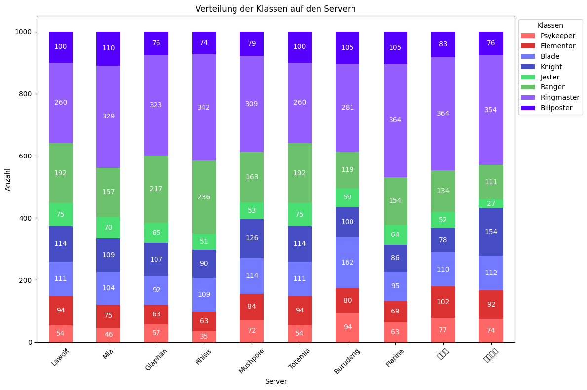
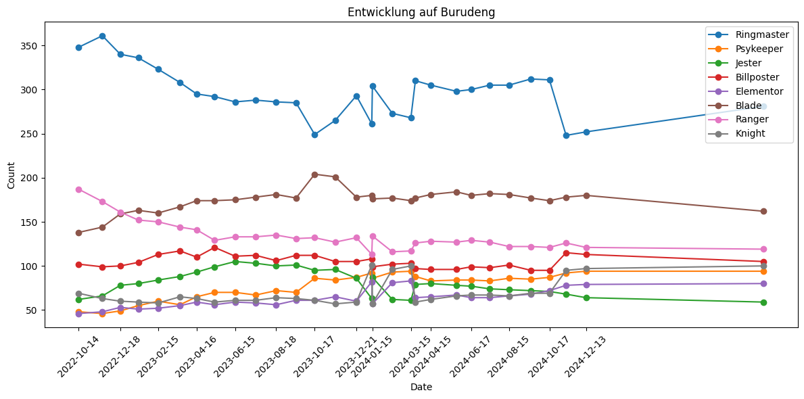

# flyff-universe-character-ranking-plotter

This character ranking plotter is made for https://www.twitch.tv/spielestyler and his monthly character rankings.
Of course, anyone else can use it too.

## Use
- Install python, depends on your os.
- Create daily plot on real time data via ```python3 flyff-character-ranking-plotter.py --new-plot```
    - This will create a fresh generated plot to the plots/daily directory
- Create timeline plot based on dataset and real time data via ```python3 flyff-character-ranking-plotter.py --new-plot --timeline```
    - This will create fresh generated plot to the plots/timeline directory

### Spielestyler mode
- Spielestyler mode to read in his "Daten" MS Excel sheet
    - Since Spielestyler uses MS Excel to save his data, there is a Spielestyler importer
    - To use that save your "Daten.xlsx" as "Daten.csv" (CSV UTF-8)
    - Put that csv file in the root directory
    - Call ```python3 flyff-character-ranking-plotter.py --import-csv ./Daten.csv```
        - This will update daily and timeline plots to plots/spielestyler directory

# Example
## Single date plot


## Timeline plot



# To Do:
- [ ] Fonts for Japanese and Chinese server to keep original names
- [x] Long term plots
- [x] Create statefile, so theres no need to generate all new
    - Save daily pulls to save data for further work